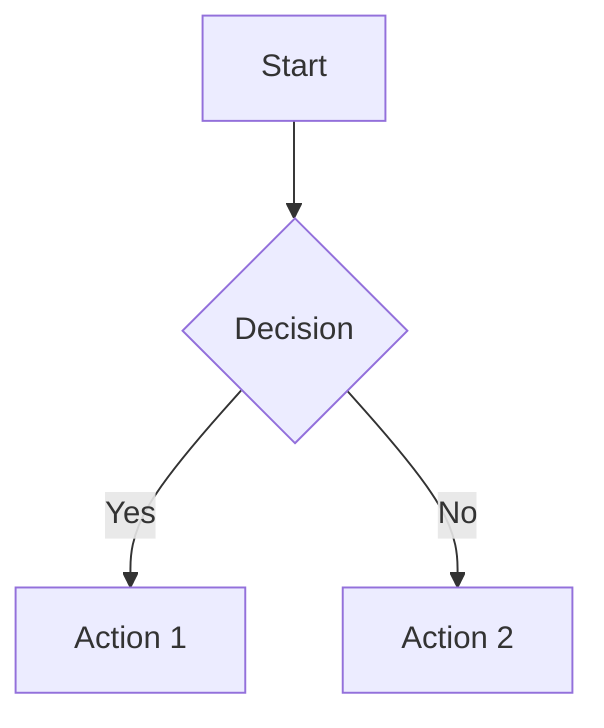
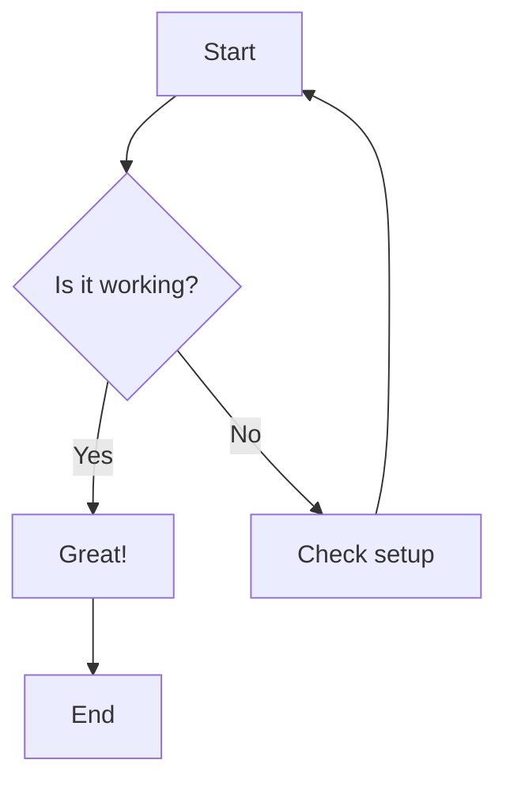
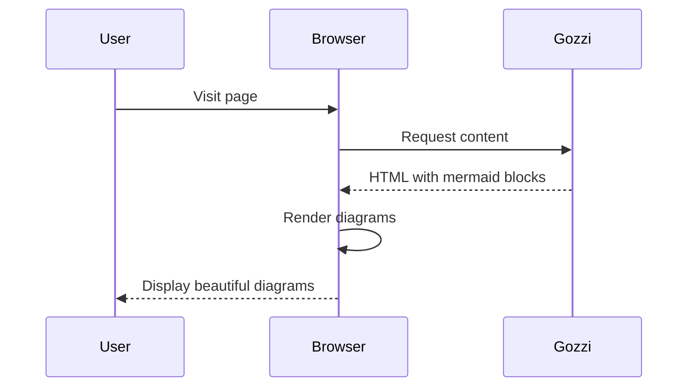
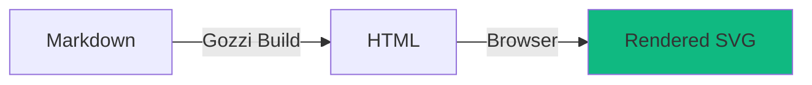

+++
title = "Mermaid Diagrams"
date = 2025-12-15
template = "page.html"
+++

Gozzi has **built-in support** for Mermaid diagrams with **client-side rendering**. Write diagrams directly in your markdown using familiar Mermaid syntax.

## How It Works

**Client-Side Rendering (Browser):**

```
Markdown: ```mermaid graph TD; A-->B; ```
    ↓ (Gozzi wraps in special container during build)
HTML: <pre class="mermaid">graph TD; A-->B;</pre>
    ↓ (MermaidJS runs in browser)
Rendered: Beautiful SVG diagram
```

**Build Time vs Browser:**

- **Build time:** Gozzi converts mermaid code blocks to `<pre class="mermaid">...</pre>` HTML
- **Browser:** MermaidJS library renders the diagram code as interactive SVG

**What You Need:**

1. **Mermaid syntax in markdown** - Standard mermaid code blocks
2. **MermaidJS library** - Must be included in your templates (see [Setup](#setup))

**What You Get:**

- ✅ Interactive diagrams with hover effects
- ✅ Theme support (light/dark modes)
- ✅ Pan and zoom capabilities
- ✅ Dynamic rendering

**💡 Why Client-Side?** Client-side rendering enables interactive features (hover, pan, zoom), automatic theme integration, and simpler builds without Node.js dependencies. Trade-off: Requires JavaScript (~200KB).

## Basic Usage

Write Mermaid diagrams in code blocks with the `mermaid` language identifier:

````markdown

````

See [Live Examples](#live-examples) below for actual rendered diagrams.

## Supported Diagram Types

Gozzi supports all Mermaid diagram types:

- **Flowcharts**: Process flows and decision trees
- **Sequence Diagrams**: System interactions over time
- **Class Diagrams**: Object-oriented relationships
- **State Diagrams**: State machine representations
- **Entity Relationship**: Database schemas
- **Gantt Charts**: Project timelines and schedules
- **Pie Charts**: Data visualization
- **Git Graphs**: Branch and commit visualization
- **User Journey**: User experience flows
- **And more**: See [Mermaid documentation](https://mermaid.js.org/) for all types

## Setup

To render Mermaid diagrams, you need to include the MermaidJS library in your templates.

### Option 1: CDN (Recommended for Most Users)

Add to your template's `<head>` or before `</body>`:

```html
<!-- Load MermaidJS from CDN -->
<script type="module">
    import mermaid from 'https://cdn.jsdelivr.net/npm/mermaid@11/dist/mermaid.esm.min.mjs';
    mermaid.initialize({ startOnLoad: true });
</script>
```

**Quick setup example** (`templates/partials/_scripts.html`):

```html
<!-- MermaidJS for diagram rendering -->
<script type="module">
    import mermaid from 'https://cdn.jsdelivr.net/npm/mermaid@11/dist/mermaid.esm.min.mjs';
    mermaid.initialize({ 
        startOnLoad: true,
        theme: 'default' // or 'dark', 'forest', 'neutral'
    });
</script>
```

**Benefits:**
- ✅ Always latest stable version
- ✅ Fast CDN delivery
- ✅ No local file management
- ✅ Automatic caching

### Option 2: Self-Hosted

For full control or offline usage, download MermaidJS:

1. **Download:** Get mermaid from [npm](https://www.npmjs.com/package/mermaid) or [GitHub releases](https://github.com/mermaid-js/mermaid/releases)

2. **Add to static directory:**
   ```
   static/
     js/
       mermaid.min.js
   ```

3. **Include in template:**
   ```html
   <script src="/js/mermaid.min.js"></script>
   <script>
       mermaid.initialize({ startOnLoad: true });
   </script>
   ```

**Benefits:**
- ✅ Full version control
- ✅ Works offline
- ✅ No external dependencies
- ✅ Custom build options

### Verify Setup

After adding MermaidJS to your templates:

1. **Add a test diagram** to any markdown file:
   ````markdown
   ```mermaid
   graph LR
       A[Setup] --> B[Working!]
   ```
   ````

2. **Build and serve:**
   ```bash
   gozzi build
   gozzi serve
   ```

3. **Check browser console** (F12) - should see no MermaidJS errors

If you see the diagram rendered as SVG, you're all set! If you see code blocks instead, check the [Troubleshooting](#troubleshooting) section.

## Advanced Configuration

Customize Mermaid's behavior with initialization options:

```html
<script type="module">
    import mermaid from 'https://cdn.jsdelivr.net/npm/mermaid@11/dist/mermaid.esm.min.mjs';
    mermaid.initialize({
        startOnLoad: true,
        theme: 'dark',
        themeVariables: {
            primaryColor: '#BB2528',
            primaryTextColor: '#fff',
            primaryBorderColor: '#7C0000',
        },
        flowchart: {
            useMaxWidth: true,
            htmlLabels: true,
            curve: 'basis',
        },
        sequence: {
            diagramMarginX: 50,
            diagramMarginY: 10,
            actorMargin: 50,
        },
    });
</script>
```

**Common configuration options:**

- `theme` - Built-in themes: `default`, `dark`, `forest`, `neutral`
- `themeVariables` - Custom color overrides
- `startOnLoad` - Auto-render on page load (keep `true`)
- `logLevel` - Debug level: `1` (debug), `2` (info), `3` (warn), `4` (error)

See [Mermaid configuration docs](https://mermaid.js.org/config/setup/modules/mermaidAPI.html) for all options.

## Styling

Mermaid diagrams automatically inherit your site's theme when configured properly. You can also add custom CSS:

```css
/* Custom diagram container styling */
.mermaid {
    text-align: center;
    margin: 2rem 0;
    background: var(--bg-secondary);
    padding: 1rem;
    border-radius: 8px;
}

/* Responsive diagrams */
.mermaid svg {
    max-width: 100%;
    height: auto;
}
```

## Dynamic Theme Switching

Match Mermaid theme to your site's light/dark mode:

```html
<script type="module">
    import mermaid from 'https://cdn.jsdelivr.net/npm/mermaid@11/dist/mermaid.esm.min.mjs';
    
    // Detect theme from data attribute or media query
    const isDark = document.documentElement.getAttribute('data-theme') === 'dark' ||
                   window.matchMedia('(prefers-color-scheme: dark)').matches;
    
    mermaid.initialize({ 
        startOnLoad: true,
        theme: isDark ? 'dark' : 'default'
    });
    
    // Re-render on theme change
    document.addEventListener('themechange', (e) => {
        mermaid.initialize({ 
            startOnLoad: true, 
            theme: e.detail.theme === 'dark' ? 'dark' : 'default'
        });
        mermaid.contentLoaded();
    });
</script>
```

## Quick Start Checklist

1. **Add MermaidJS to your templates:**
   ```html
   <script type="module">
       import mermaid from 'https://cdn.jsdelivr.net/npm/mermaid@11/dist/mermaid.esm.min.mjs';
       mermaid.initialize({ startOnLoad: true });
   </script>
   ```

2. **Write diagram in markdown:**
   ````markdown
   ```mermaid
   graph LR
       A --> B
   ```
   ````

3. **Build and view:**
   ```bash
   gozzi build
   gozzi serve
   ```

That's it! Your diagrams will render as interactive SVG in the browser.

## Live Examples

Here are actual rendered diagrams to demonstrate the feature:

**Simple Flowchart:**



**Sequence Diagram:**



**Simple Architecture:**




