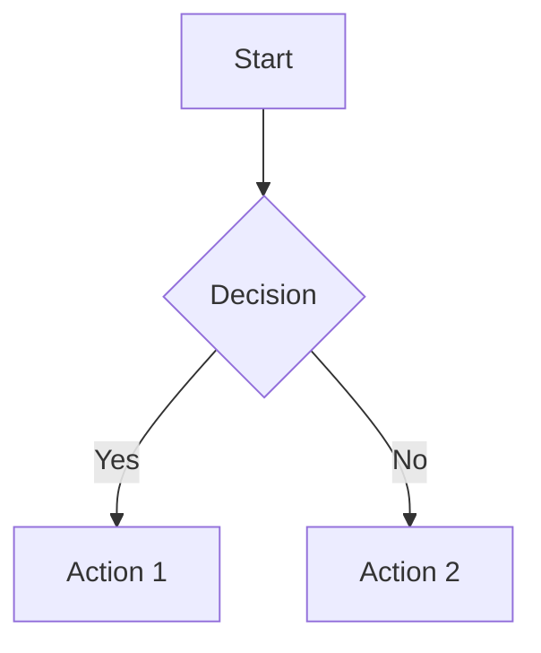
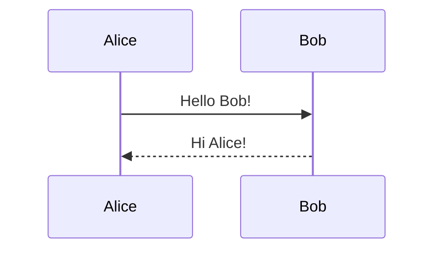
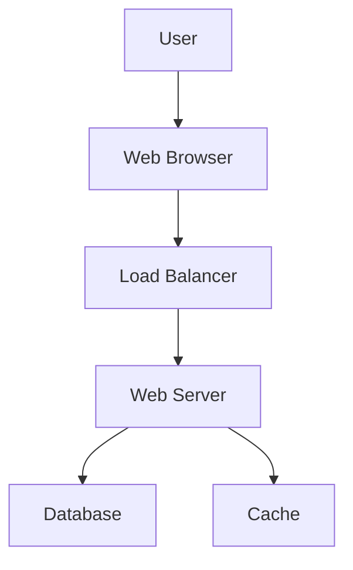
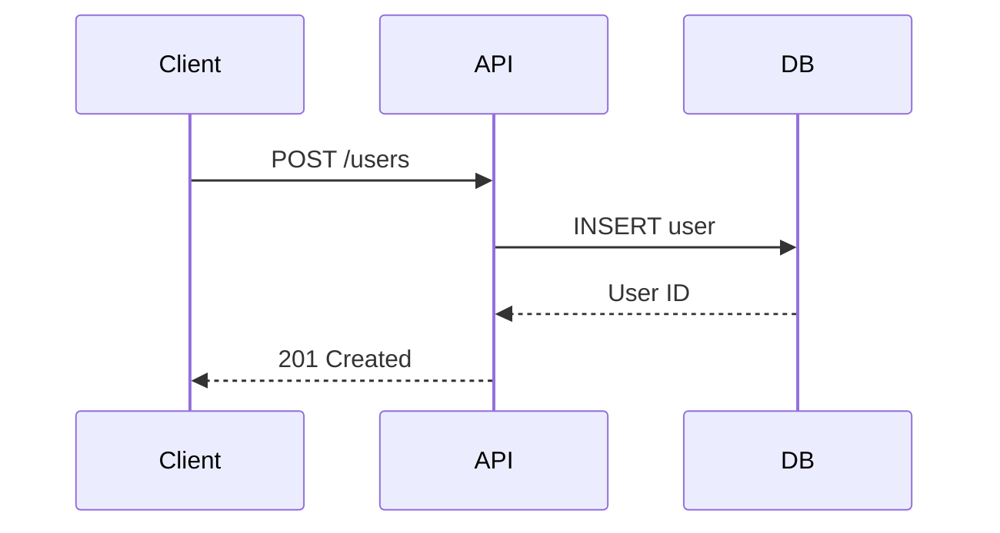
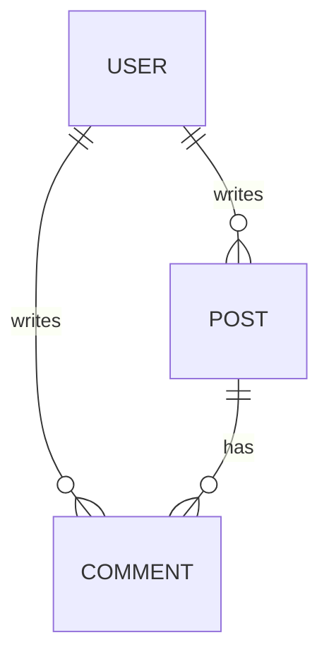

# Built-in Features

Gozzi includes comprehensive features that enhance your static site without requiring additional plugins.

## Table of Contents (TOC)

Gozzi automatically generates a table of contents from your content headings.

### Usage in Templates

::: details Example Template Code

```html
<!-- Basic TOC display -->
{{ if .Toc }}
<nav class="toc">
    <h3>Table of Contents</h3>
    {{ .Toc }}
</nav>
{{ end }}
```

:::

## Tag Management

Comprehensive tag management with automatic collection across content.

### Template Variables

::: details Template Examples

```html
<!-- Display tags for current page -->
{{ range .Tags }}
<span class="tag">{{ . }}</span>
{{ end }}

<!-- Access all site tags -->
{{ range .Site.Tags }}
<a href="/tags/{{ . | urlize }}">{{ . }}</a>
{{ end }}
```

:::

## Pagination

Built-in pagination for large content collections.

### Configuration

```toml
[pagination]
per_page = 10
pagination_path = "page"
```

### Template Usage

::: details Pagination Template

```html
{{ range .Paginate.Items }}
<article>
    <h2>{{ .Title }}</h2>
</article>
{{ end }} {{ if .Paginate.HasPrev }}
<a href="{{ .Paginate.PrevURL }}">← Previous</a>
{{ end }} {{ if .Paginate.HasNext }}
<a href="{{ .Paginate.NextURL }}">Next →</a>
{{ end }}
```

:::

## RSS/Atom Feeds

Automatically generates RSS feeds.

- **Location**: `/atom.xml`
- **Format**: Atom 1.0
- **Content**: Latest posts with full content

### Configuration

```toml
[feed]
enabled = true
limit = 20
include_content = true
title = "My Blog Feed"
```

## SEO Automation

### Sitemap Generation

- **Location**: `/sitemap.xml`
- **Format**: XML sitemap protocol
- **Content**: All pages with modification dates

### Robots.txt

- **Location**: `/robots.txt`
- **Customizable**: Override with `static/robots.txt`

## Content Analytics

### Word Count & Reading Time

::: details Template Examples

```html
<p>{{ .WordCount }} words</p>

{{ if gt .WordCount 1000 }}
<span class="long-read">Long read</span>
{{ end }}

<p>{{ .ReadingTime }} min read</p>
```

:::

## Mathematical Expressions (KaTeX)

Gozzi has **native support** for mathematical expressions using KaTeX. Math is rendered **server-side during build**, resulting in faster page loads with no JavaScript dependency for rendering.

### How It Works

**Server-Side Rendering (Build Time):**

```
Markdown: $E = mc^2$
    ↓ (Gozzi processes during build)
HTML: <span class="katex">...fully rendered math...</span>
```

**What You Need:**

- ✅ **Nothing for rendering** - Math is already in HTML
- ✅ **CSS for styling** - Just like syntax highlighting (see [Styling](#styling) below)

**What You Don't Need:**

- ❌ KaTeX JavaScript library
- ❌ Client-side rendering code
- ❌ Runtime math processing

::: tip Why This Matters
Traditional setups require ~330KB of JavaScript to render math in the browser on every page load. Gozzi does this once during build, so your users get instant math display with zero JavaScript overhead!
:::

### Basic Usage

Simply write math expressions in your markdown using standard delimiters:

**Inline math** - Wrap with single `$`:

```markdown
The famous equation $E = mc^2$ shows mass-energy equivalence.
```

**Block math** - Wrap with double `$$`:

```markdown
$$
\int_{-\infty}^{\infty} e^{-x^2} dx = \sqrt{\pi}
$$
```

### Example

::: details Complete Math Example

```markdown
# Understanding Geometry

Given the radius $r$ of a circle, the area $A$ is:

$$
A = \pi \times r^2
$$

And the circumference $C$ is:

$$
C = 2 \pi r
$$

For derivatives, we use $\frac{dy}{dx}$ notation.
```

:::

### Advanced Features

KaTeX supports complex mathematical notation:

- **Fractions**: `$\frac{a}{b}$`
- **Subscripts/Superscripts**: `$x^2$`, `$a_i$`
- **Greek letters**: `$\alpha, \beta, \gamma$`
- **Integrals**: `$\int_0^\infty f(x) dx$`
- **Summations**: `$\sum_{i=1}^{n} i$`
- **Matrices**:

```markdown
$$
\begin{bmatrix}
a & b \\
c & d
\end{bmatrix}
$$
```

### Styling

The math is rendered as semantic HTML with KaTeX classes. You need to include KaTeX CSS for proper visual styling:

#### Option 1: CDN (Recommended)

```html
<!-- In your template head -->
<link
    rel="stylesheet"
    href="https://cdn.jsdelivr.net/npm/katex@0.16.9/dist/katex.min.css"
    crossorigin="anonymous"
/>
```

**Benefits:**

- Fast CDN delivery
- Cached across websites
- No self-hosting needed

#### Option 2: Self-Hosted

```bash
# Download KaTeX CSS to your static directory
curl -o static/css/katex.min.css \
  https://cdn.jsdelivr.net/npm/katex@0.16.9/dist/katex.min.css

# Download fonts
curl -L -o static/fonts/katex-fonts.tar.gz \
  https://github.com/KaTeX/KaTeX/releases/download/v0.16.9/katex-fonts.tar.gz
tar -xzf static/fonts/katex-fonts.tar.gz -C static/fonts/
```

```html
<!-- In your template head -->
<link rel="stylesheet" href="/css/katex.min.css" />
```

**Benefits:**

- No external dependencies
- Full control over assets
- Works offline

::: tip CSS vs JavaScript
**Why CSS is required but JavaScript isn't:**

CSS provides visual styling (fonts, spacing, layout) - this is normal for all HTML content. The key difference is:

- **Traditional approach:** Browser downloads 330KB JavaScript + runs math renderer on every page load
- **Gozzi's approach:** Math is pre-rendered to HTML during build + browser loads 50KB CSS (same as any stylesheet)

The math is already in your HTML - CSS just makes it look beautiful!
:::

#### Comparison: Native vs Client-Side

| Aspect               | Gozzi (Native)             | Traditional (Client-Side)     |
| -------------------- | -------------------------- | ----------------------------- |
| **Rendering**        | Server-side (build time)   | Browser (every page load)     |
| **JavaScript**       | ❌ Not needed              | ✅ Required (~330KB)          |
| **CSS**              | ✅ Required (~50KB)        | ✅ Required (~50KB)           |
| **Page Load Speed**  | ⚡ Instant                 | 🐌 Waits for JS               |
| **SEO**              | ✅ Search engines see math | ❌ Search engines see `$...$` |
| **Works Without JS** | ✅ Yes                     | ❌ No                         |

### Quick Start Checklist

To use native KaTeX math in your Gozzi site:

1. **Write math in your markdown** (that's it for content!)

    ```markdown
    The formula $E = mc^2$ is famous.
    ```

2. **Add KaTeX CSS to your template** (one-time setup)

    ```html
    <!-- templates/partials/_head.html -->
    <link rel="stylesheet" href="https://cdn.jsdelivr.net/npm/katex@0.16.9/dist/katex.min.css" />
    ```

3. **Build your site**
    ```bash
    gozzi build
    ```

That's it! Your math is now rendered and ready. No JavaScript configuration, no runtime rendering, no build plugins needed.

::: warning Common Mistake
If you see unstyled math (raw characters like `x=−b±√b²−4ac/2a`), it means the KaTeX CSS is missing. The math is already rendered in your HTML - just add the stylesheet to your template!
:::

### Troubleshooting

#### Math displays as raw text: `x=−b±√b²−4ac/2a`

**Problem:** You see unstyled characters instead of properly formatted equations.

**Solution:** Add KaTeX CSS to your template's `<head>` section:

```html
<link rel="stylesheet" href="https://cdn.jsdelivr.net/npm/katex@0.16.9/dist/katex.min.css" />
```

**Why:** Gozzi renders math to HTML during build (✅ working!), but CSS is needed for visual styling. Think of it like syntax highlighting - the code is in HTML, CSS makes it colorful.

#### Math doesn't render at all

**Problem:** You see the raw LaTeX source: `$E = mc^2$` in the output.

**Possible causes:**

1. Check if you're using the correct delimiters (`$...$` for inline, `$$...$$` for block)
2. Verify the markdown file extension is `.md`
3. Rebuild your site: `gozzi build`

#### Complex math renders incorrectly

**Problem:** Matrix or multi-line equations split across paragraphs.

**Solution:** Keep complex expressions on a single line within `$$` blocks:

```markdown
<!-- ✅ Good -->

$$
\begin{bmatrix} a & b \\ c & d \end{bmatrix}
$$

<!-- ❌ Avoid multiple separate blocks on separate lines with operators between -->
```

For very complex expressions, consider breaking them into separate display math blocks.

### FAQ

**Q: Do I need to install KaTeX on my build server?**  
A: No! Gozzi includes KaTeX rendering. Just `go build` and you're ready.

**Q: Can I use KaTeX offline/without CDN?**  
A: Yes! Download `katex.min.css` and host it in your `static/` directory. See [Option 2: Self-Hosted](#option-2-self-hosted) above.

**Q: Does this work with all KaTeX features?**  
A: Yes! Gozzi uses the official KaTeX library, so all [KaTeX functions](https://katex.org/docs/supported.html) are supported.

**Q: Why not just use JavaScript like everyone else?**  
A: Server-side rendering means:

- ⚡ Faster page loads (no JS execution)
- 🔍 Better SEO (search engines see real math)
- ♿ Better accessibility (works without JS)
- 📱 Less bandwidth (no 330KB JS library)

## Mermaid Diagrams

Gozzi has **built-in support** for Mermaid diagrams with **client-side rendering**. Write diagrams directly in your markdown using familiar Mermaid syntax.

### How It Works

**Client-Side Rendering (Browser):**

```
Markdown: ```mermaid graph TD; A-->B; ```
    ↓ (Gozzi wraps in special container during build)
HTML: <pre class="mermaid">graph TD; A-->B;</pre>
    ↓ (MermaidJS runs in browser)
Rendered: Beautiful SVG diagram
```

**What You Need:**

- ✅ **Mermaid syntax in markdown** - Standard mermaid code blocks
- ✅ **MermaidJS library** - Loaded via CDN or self-hosted (see [Setup](#setup) below)

**What You Get:**

- ✅ Interactive diagrams with hover effects
- ✅ Theme support (light/dark modes)
- ✅ Pan and zoom capabilities
- ✅ Dynamic rendering

::: tip Why Client-Side?
Unlike KaTeX (which renders server-side), Mermaid uses **client-side rendering** because:

- **Interactive features** - Hover tooltips, click events, pan/zoom
- **Theme integration** - Automatically matches your site's light/dark theme
- **Simpler builds** - No Node.js/Mermaid CLI dependency for building
- **Still "native"** - Built into Gozzi's markdown parser, just renders in browser

Trade-off: Requires JavaScript (~200KB) but enables richer diagram interactions.
:::

### Basic Usage

Write Mermaid diagrams in standard code blocks with the `mermaid` language identifier:

**Flowchart:**

````markdown

````

**Sequence Diagram:**

````markdown

````

### Supported Diagram Types

Gozzi supports all Mermaid diagram types:

- **Flowcharts**: Process flows and decision trees
- **Sequence Diagrams**: System interactions over time
- **Class Diagrams**: Object-oriented relationships
- **State Diagrams**: State machine representations
- **Entity Relationship**: Database schemas
- **Gantt Charts**: Project timelines and schedules
- **Pie Charts**: Data visualization
- **Git Graphs**: Branch and commit visualization
- **User Journey**: User experience flows
- **And more**: See [Mermaid documentation](https://mermaid.js.org/) for all types

### Setup

**Good news:** Gozzi automatically handles MermaidJS for you! No template configuration needed.

#### How It Works

When you use mermaid code blocks in your markdown, Gozzi:

1. Wraps your diagram code in `<pre class="mermaid">` tags
2. Automatically injects the MermaidJS library from CDN
3. Adds initialization code: `mermaid.initialize({startOnLoad: true})`

**Zero configuration required!** Just write your diagrams in markdown and Gozzi handles the rest.

#### Advanced: Custom MermaidJS Setup (Optional)

If you want to customize MermaidJS behavior (themes, configuration), you can disable auto-injection and manage it yourself:

**Note:** This is only needed for advanced customization. Most users don't need this!

1. Gozzi's automatic injection uses the latest MermaidJS from CDN with default settings
2. If you need custom themes or configuration, you'll need to modify `app/markdown/mermaid.go`

For most use cases, the automatic setup works perfectly.

### Advanced Configuration

Customize Mermaid's behavior with initialization options:

```html
<script type="module">
    import mermaid from 'https://cdn.jsdelivr.net/npm/mermaid@11/dist/mermaid.esm.min.mjs';
    mermaid.initialize({
        startOnLoad: true,
        theme: 'dark',
        themeVariables: {
            primaryColor: '#BB2528',
            primaryTextColor: '#fff',
            primaryBorderColor: '#7C0000',
        },
        flowchart: {
            useMaxWidth: true,
            htmlLabels: true,
            curve: 'basis',
        },
        sequence: {
            diagramMarginX: 50,
            diagramMarginY: 10,
            actorMargin: 50,
        },
    });
</script>
```

### Example

::: details Complete Example with Multiple Diagrams

```markdown
# System Architecture

## User Flow



## API Sequence



## Data Model


````

:::

### Styling

Mermaid diagrams automatically inherit your site's theme when configured properly. You can also add custom CSS:

```css
/* Custom diagram container styling */
.mermaid {
    text-align: center;
    margin: 2rem 0;
    background: var(--bg-secondary);
    padding: 1rem;
    border-radius: 8px;
}

/* Responsive diagrams */
.mermaid svg {
    max-width: 100%;
    height: auto;
}
```

### Quick Start Checklist

1. **Write diagram in markdown** (that's it!)

    ````markdown
    ```mermaid
    graph LR
        A --> B
    ```
    ````

2. **Build and view**
    ```bash
    gozzi build
    gozzi serve
    ```

That's it! Gozzi automatically handles the MermaidJS library - no template configuration needed.

### Troubleshooting

#### Diagrams don't render (show as code blocks)

**Problem:** You see the raw mermaid syntax in a code block instead of a rendered diagram.

**Possible causes:**

1. **JavaScript disabled** - MermaidJS requires JavaScript to run
2. **Browser console errors** - Check browser dev tools for errors
3. **Outdated browser** - MermaidJS requires modern browser features

**Solution:**

- Check browser console (F12) for error messages
- Ensure JavaScript is enabled
- Try a different browser (Chrome, Firefox, Safari)

#### Diagrams render with wrong theme

**Problem:** Diagrams appear in light theme when your site uses dark mode.

**Solution:** Update theme in mermaid configuration:

```javascript
mermaid.initialize({ startOnLoad: true, theme: 'dark' });
```

Or dynamically detect theme:

```javascript
const theme = document.documentElement.getAttribute('data-theme') === 'dark' ? 'dark' : 'default';
mermaid.initialize({ startOnLoad: true, theme: theme });
```

#### Diagrams flicker on page load

**Problem:** You see code blocks briefly before diagrams render.

**Solution:** Hide mermaid blocks until rendered:

```css
.mermaid {
    opacity: 0;
    transition: opacity 0.3s;
}

.mermaid[data-processed='true'] {
    opacity: 1;
}
```

#### Complex diagrams cause layout issues

**Problem:** Large diagrams overflow or break responsive layout.

**Solution:** Add responsive container styling:

```css
.mermaid {
    max-width: 100%;
    overflow-x: auto;
}

.mermaid svg {
    max-width: 100%;
    height: auto;
}
```

### FAQ

**Q: Why not render Mermaid server-side like KaTeX?**  
A: Server-side Mermaid would require:

-   Node.js + Mermaid CLI installed on build server
-   ~500MB dependencies
-   Slower builds
-   Loss of interactive features (hover, click, pan/zoom)
-   No dynamic theme switching

Client-side rendering is simpler and more feature-rich for diagrams.

**Q: Can I use Mermaid offline/without CDN?**  
A: Currently, Gozzi uses the CDN version automatically. For offline use, you would need to modify `app/markdown/mermaid.go` to point to a self-hosted version. This is an advanced customization.

**Q: Does this work with all Mermaid diagram types?**  
A: Yes! Gozzi uses standard mermaid code blocks, so all [Mermaid diagram types](https://mermaid.js.org/intro/syntax-reference.html) are supported.

**Q: Can I customize diagram colors and styles?**  
A: Yes! Use `themeVariables` in mermaid configuration. See [Advanced Configuration](#advanced-configuration) above.

**Q: Will diagrams work for users with JavaScript disabled?**  
A: No, client-side Mermaid requires JavaScript. Consider adding a fallback message:

```html
<noscript>
    <p>Interactive diagrams require JavaScript to display. Please enable JavaScript to view diagrams.</p>
</noscript>
```

## Social Media Integration

Automatic image URL generation for social sharing.

```yaml
# Front matter
featured_image: 'cover.jpg'
image: '/images/post-cover.png'
```

## Performance

All built-in features are optimized for speed:

- **Server-Side Rendering**: KaTeX math and syntax highlighting rendered during build time
- **Client-Side Rendering**: Mermaid diagrams render in browser for interactivity
- **Fast Builds**: Native features add minimal overhead (still sub-second for most sites)
- **Caching**: Generated content cached until source changes
- **Minimal JS**: Only Mermaid requires JavaScript (~200KB); math and code work without JS

## Feature Integration

Built-in features work seamlessly together:

- Tag pages include pagination automatically
- RSS feeds respect tag filtering
- Social meta tags use calculated reading times
- TOC generation works with KaTeX math, Mermaid diagrams, and syntax highlighting
- Server-side features (KaTeX, syntax highlighting) have zero runtime overhead
- Client-side features (Mermaid) load asynchronously without blocking page render
- All features respect configuration inheritance

For more details, see:

- [Configuration](/guide/configuration)
- [Templates](/guide/templates)
- [Template Functions](/reference/template-functions)
