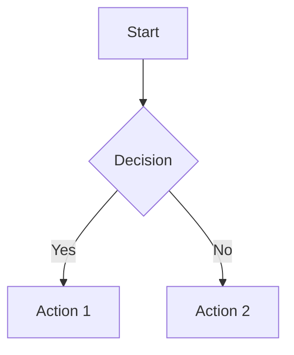

# Built-in Features

Gozzi includes comprehensive features that enhance your static site without requiring additional plugins.

## Table of Contents (TOC)

Gozzi automatically generates a table of contents from your content headings.

### Usage in Templates

::: details Example Template Code
```html
<!-- Basic TOC display -->
{{ if .Toc }}
<nav class="toc">
  <h3>Table of Contents</h3>
  {{ .Toc }}
</nav>
{{ end }}
```
:::

## Tag Management

Comprehensive tag management with automatic collection across content.

### Template Variables

::: details Template Examples
```html
<!-- Display tags for current page -->
{{ range .Tags }}
  <span class="tag">{{ . }}</span>
{{ end }}

<!-- Access all site tags -->
{{ range .Site.Tags }}
  <a href="/tags/{{ . | urlize }}">{{ . }}</a>
{{ end }}
```
:::

## Pagination

Built-in pagination for large content collections.

### Configuration

```toml
[pagination]
per_page = 10
pagination_path = "page"
```

### Template Usage

::: details Pagination Template
```html
{{ range .Paginate.Items }}
  <article>
    <h2>{{ .Title }}</h2>
  </article>
{{ end }}

{{ if .Paginate.HasPrev }}
  <a href="{{ .Paginate.PrevURL }}">← Previous</a>
{{ end }}

{{ if .Paginate.HasNext }}
  <a href="{{ .Paginate.NextURL }}">Next →</a>
{{ end }}
```
:::

## RSS/Atom Feeds

Automatically generates RSS feeds.

- **Location**: `/atom.xml`
- **Format**: Atom 1.0
- **Content**: Latest posts with full content

### Configuration

```toml
[feed]
enabled = true
limit = 20
include_content = true
title = "My Blog Feed"
```

## SEO Automation

### Sitemap Generation
- **Location**: `/sitemap.xml`
- **Format**: XML sitemap protocol
- **Content**: All pages with modification dates

### Robots.txt
- **Location**: `/robots.txt`
- **Customizable**: Override with `static/robots.txt`

## Content Analytics

### Word Count & Reading Time

::: details Template Examples
```html
<p>{{ .WordCount }} words</p>

{{ if gt .WordCount 1000 }}
  <span class="long-read">Long read</span>
{{ end }}

<p>{{ .ReadingTime }} min read</p>
```
:::

## Mathematical Expressions (KaTeX)

Gozzi has **native support** for mathematical expressions using KaTeX. Math is rendered **server-side during build**, resulting in faster page loads with no JavaScript dependency for rendering.

### Basic Usage

Simply write math expressions in your markdown using standard delimiters:

**Inline math** - Wrap with single `$`:
```markdown
The famous equation $E = mc^2$ shows mass-energy equivalence.
```

**Block math** - Wrap with double `$$`:
```markdown
$$
\int_{-\infty}^{\infty} e^{-x^2} dx = \sqrt{\pi}
$$
```

### Example

::: details Complete Math Example
```markdown
# Understanding Geometry

Given the radius $r$ of a circle, the area $A$ is:

$$
A = \pi \times r^2
$$

And the circumference $C$ is:

$$
C = 2 \pi r
$$

For derivatives, we use $\frac{dy}{dx}$ notation.
```
:::

### Advanced Features

KaTeX supports complex mathematical notation:

- **Fractions**: `$\frac{a}{b}$`
- **Subscripts/Superscripts**: `$x^2$`, `$a_i$`
- **Greek letters**: `$\alpha, \beta, \gamma$`
- **Integrals**: `$\int_0^\infty f(x) dx$`
- **Summations**: `$\sum_{i=1}^{n} i$`
- **Matrices**:
```markdown
$$
\begin{bmatrix}
a & b \\
c & d
\end{bmatrix}
$$
```

### Styling

The math is rendered as HTML with KaTeX classes. Include KaTeX CSS in your template for proper styling:

```html
<!-- In your template head -->
<link rel="stylesheet" href="https://cdn.jsdelivr.net/npm/katex@0.16.9/dist/katex.min.css">
```

::: tip
Unlike other generators, Gozzi renders math **server-side** during build. The CSS is only needed for styling - no JavaScript runtime required!
:::

## Mermaid Diagrams

Gozzi has **native support** for Mermaid diagrams. Create beautiful diagrams directly in your markdown.

### Example

````markdown

````

### Supported Diagram Types
- **Flowcharts**: Process flows and decision trees
- **Sequence Diagrams**: System interactions over time
- **Gantt Charts**: Project timelines and schedules  
- **Class Diagrams**: Object-oriented relationships
- **State Diagrams**: State machine representations
- **And more**: See [Mermaid documentation](https://mermaid.js.org/) for all types

## Social Media Integration

Automatic image URL generation for social sharing.

```yaml
# Front matter
featured_image: "cover.jpg"
image: "/images/post-cover.png"
```

## Performance

All built-in features are optimized for speed:

- **Server-Side Rendering**: KaTeX and Mermaid rendered during build time
- **Fast Builds**: Native features add minimal overhead (still sub-second for most sites)
- **Caching**: Generated content cached until source changes
- **No Runtime JS**: Math and diagrams work without JavaScript

## Feature Integration

Built-in features work seamlessly together:
- Tag pages include pagination automatically
- RSS feeds respect tag filtering
- Social meta tags use calculated reading times
- TOC generation works with KaTeX math and Mermaid diagrams
- All features respect configuration inheritance

For more details, see:
- [Configuration](/guide/configuration)
- [Templates](/guide/templates)
- [Template Functions](/reference/template-functions)
