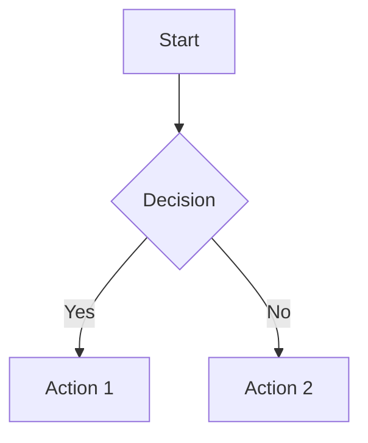

# Built-in Features

Gozzi includes comprehensive features that enhance your static site without requiring additional plugins.

## Table of Contents (TOC)

Gozzi automatically generates a table of contents from your content headings.

### Usage in Templates

::: details Example Template Code
```html
<!-- Basic TOC display -->
{{ if .Toc }}
<nav class="toc">
  <h3>Table of Contents</h3>
  {{ .Toc }}
</nav>
{{ end }}
```
:::

## Tag Management

Comprehensive tag management with automatic collection across content.

### Template Variables

::: details Template Examples
```html
<!-- Display tags for current page -->
{{ range .Tags }}
  <span class="tag">{{ . }}</span>
{{ end }}

<!-- Access all site tags -->
{{ range .Site.Tags }}
  <a href="/tags/{{ . | urlize }}">{{ . }}</a>
{{ end }}
```
:::

## Pagination

Built-in pagination for large content collections.

### Configuration

```toml
[pagination]
per_page = 10
pagination_path = "page"
```

### Template Usage

::: details Pagination Template
```html
{{ range .Paginate.Items }}
  <article>
    <h2>{{ .Title }}</h2>
  </article>
{{ end }}

{{ if .Paginate.HasPrev }}
  <a href="{{ .Paginate.PrevURL }}">← Previous</a>
{{ end }}

{{ if .Paginate.HasNext }}
  <a href="{{ .Paginate.NextURL }}">Next →</a>
{{ end }}
```
:::

## RSS/Atom Feeds

Automatically generates RSS feeds.

- **Location**: `/atom.xml`
- **Format**: Atom 1.0
- **Content**: Latest posts with full content

### Configuration

```toml
[feed]
enabled = true
limit = 20
include_content = true
title = "My Blog Feed"
```

## SEO Automation

### Sitemap Generation
- **Location**: `/sitemap.xml`
- **Format**: XML sitemap protocol
- **Content**: All pages with modification dates

### Robots.txt
- **Location**: `/robots.txt`
- **Customizable**: Override with `static/robots.txt`

## Content Analytics

### Word Count & Reading Time

::: details Template Examples
```html
<p>{{ .WordCount }} words</p>

{{ if gt .WordCount 1000 }}
  <span class="long-read">Long read</span>
{{ end }}

<p>{{ .ReadingTime }} min read</p>
```
:::

## Mathematical Expressions (KaTeX)

Render beautiful math using KaTeX.

### Basic Usage

```markdown
Inline math: $E = mc^2$

Block math:
$$
\int_{-\infty}^{\infty} e^{-x^2} dx = \sqrt{\pi}
$$
```

### Configuration

```toml
[math]
enabled = true
auto_render = true
```

## Mermaid Diagrams

Create diagrams using Mermaid syntax.

### Example

````markdown

````

### Supported Types
- Flowcharts
- Sequence Diagrams
- Gantt Charts
- Class Diagrams
- State Diagrams

## Social Media Integration

Automatic image URL generation for social sharing.

```yaml
# Front matter
featured_image: "cover.jpg"
image: "/images/post-cover.png"
```

## Performance

All features are optimized for speed:

- **Lazy Loading**: Features activate only when needed
- **Caching**: Generated content cached until changes
- **Minimal Overhead**: Fast build times
- **Selective Inclusion**: External resources only when used

## Feature Integration

Features work seamlessly together:
- Tag pages include pagination automatically
- RSS feeds respect tag filtering
- Social meta tags use calculated reading times
- TOC generation works with math and diagrams

For more details, see:
- [Configuration](/guide/configuration)
- [Templates](/guide/templates)
- [Template Functions](/reference/template-functions)
