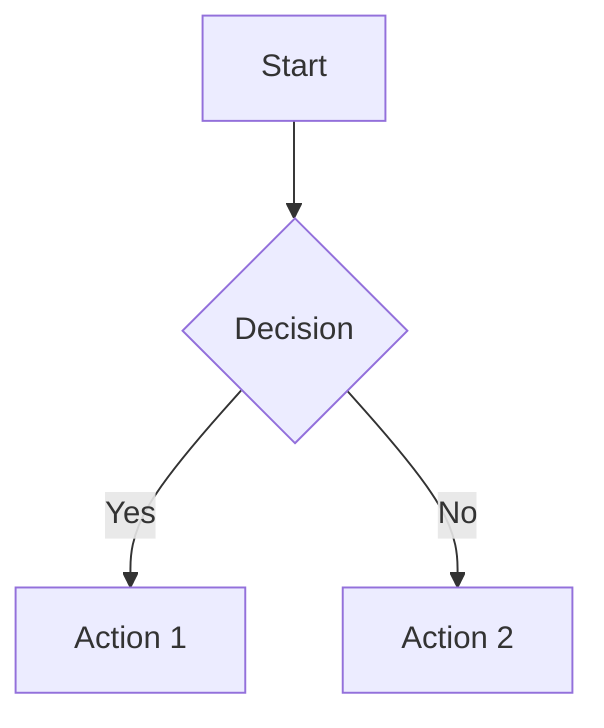
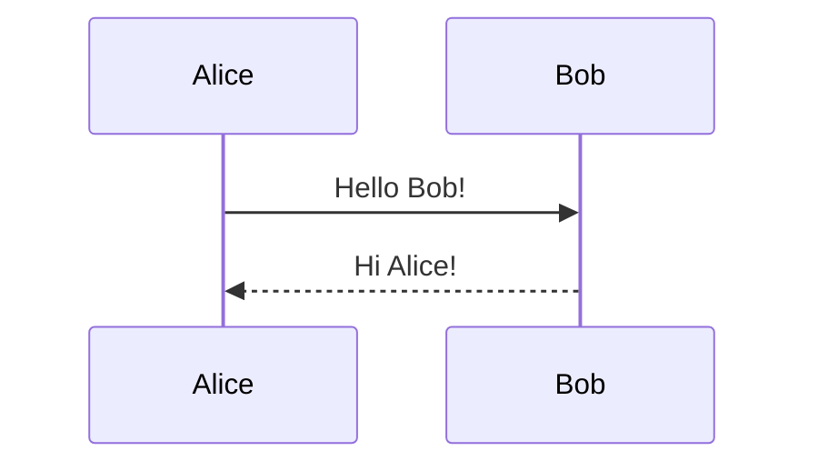
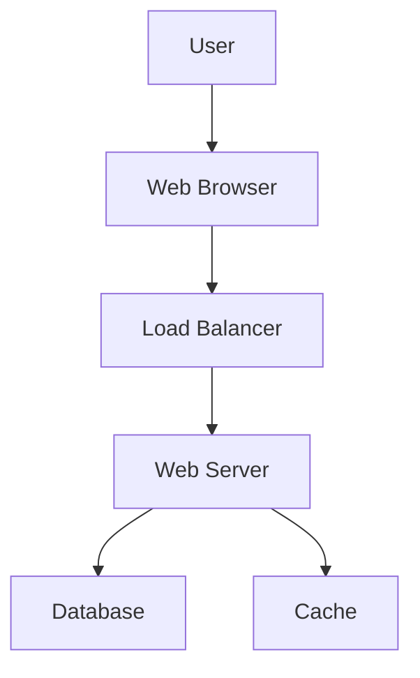
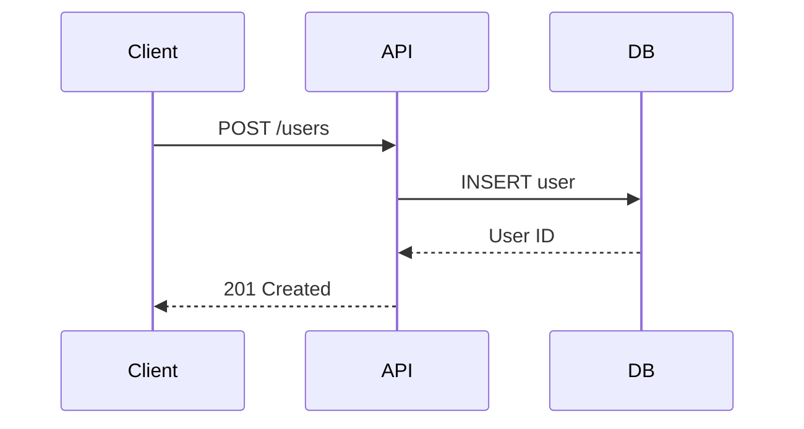
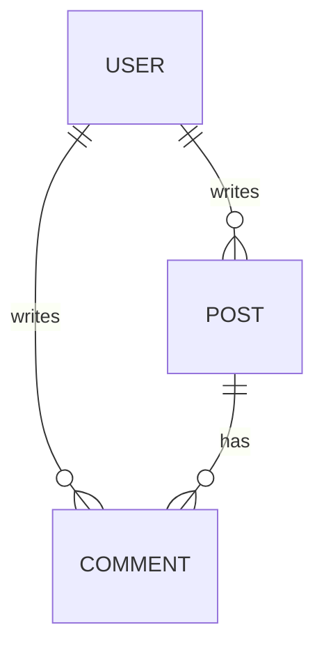

# Mermaid Diagrams

Gozzi has **built-in support** for Mermaid diagrams with **client-side rendering**. Write diagrams directly in your markdown using familiar Mermaid syntax.

## How It Works

**Client-Side Rendering (Browser):**

```
Markdown: ```mermaid graph TD; A-->B; ```
    ↓ (Gozzi wraps in special container during build)
HTML: <pre class="mermaid">graph TD; A-->B;</pre>
    ↓ (MermaidJS runs in browser)
Rendered: Beautiful SVG diagram
```

**What You Need:**

- ✅ **Mermaid syntax in markdown** - Standard mermaid code blocks
- ✅ **MermaidJS library** - Loaded via CDN or self-hosted (see [Setup](#setup) below)

**What You Get:**

- ✅ Interactive diagrams with hover effects
- ✅ Theme support (light/dark modes)
- ✅ Pan and zoom capabilities
- ✅ Dynamic rendering

::: tip Why Client-Side?
Unlike KaTeX (which renders server-side), Mermaid uses **client-side rendering** because:

- **Interactive features** - Hover tooltips, click events, pan/zoom
- **Theme integration** - Automatically matches your site's light/dark theme
- **Simpler builds** - No Node.js/Mermaid CLI dependency for building
- **Still "native"** - Built into Gozzi's markdown parser, just renders in browser

Trade-off: Requires JavaScript (~200KB) but enables richer diagram interactions.
:::

## Basic Usage

Write Mermaid diagrams in standard code blocks with the `mermaid` language identifier:

**Flowchart:**

````markdown

````

**Sequence Diagram:**

````markdown

````

## Supported Diagram Types

Gozzi supports all Mermaid diagram types:

- **Flowcharts**: Process flows and decision trees
- **Sequence Diagrams**: System interactions over time
- **Class Diagrams**: Object-oriented relationships
- **State Diagrams**: State machine representations
- **Entity Relationship**: Database schemas
- **Gantt Charts**: Project timelines and schedules
- **Pie Charts**: Data visualization
- **Git Graphs**: Branch and commit visualization
- **User Journey**: User experience flows
- **And more**: See [Mermaid documentation](https://mermaid.js.org/) for all types

## Setup

**Good news:** Gozzi automatically handles MermaidJS for you! No template configuration needed.

### How It Works

When you use mermaid code blocks in your markdown, Gozzi:

1. Wraps your diagram code in `<pre class="mermaid">` tags
2. Automatically injects the MermaidJS library from CDN
3. Adds initialization code: `mermaid.initialize({startOnLoad: true})`

**Zero configuration required!** Just write your diagrams in markdown and Gozzi handles the rest.

### Advanced: Custom MermaidJS Setup (Optional)

If you want to customize MermaidJS behavior (themes, configuration), you can disable auto-injection and manage it yourself:

**Note:** This is only needed for advanced customization. Most users don't need this!

1. Gozzi's automatic injection uses the latest MermaidJS from CDN with default settings
2. If you need custom themes or configuration, you'll need to modify `app/markdown/mermaid.go`

For most use cases, the automatic setup works perfectly.

## Advanced Configuration

Customize Mermaid's behavior with initialization options:

```html
<script type="module">
    import mermaid from 'https://cdn.jsdelivr.net/npm/mermaid@11/dist/mermaid.esm.min.mjs';
    mermaid.initialize({
        startOnLoad: true,
        theme: 'dark',
        themeVariables: {
            primaryColor: '#BB2528',
            primaryTextColor: '#fff',
            primaryBorderColor: '#7C0000',
        },
        flowchart: {
            useMaxWidth: true,
            htmlLabels: true,
            curve: 'basis',
        },
        sequence: {
            diagramMarginX: 50,
            diagramMarginY: 10,
            actorMargin: 50,
        },
    });
</script>
```

## Example

::: details Complete Example with Multiple Diagrams

```markdown
# System Architecture

## User Flow



## API Sequence



## Data Model


````

:::

## Styling

Mermaid diagrams automatically inherit your site's theme when configured properly. You can also add custom CSS:

```css
/* Custom diagram container styling */
.mermaid {
    text-align: center;
    margin: 2rem 0;
    background: var(--bg-secondary);
    padding: 1rem;
    border-radius: 8px;
}

/* Responsive diagrams */
.mermaid svg {
    max-width: 100%;
    height: auto;
}
```

## Quick Start Checklist

1. **Write diagram in markdown** (that's it!)

    ````markdown
    ```mermaid
    graph LR
        A --> B
    ```
    ````

2. **Build and view**
    ```bash
    gozzi build
    gozzi serve
    ```

That's it! Gozzi automatically handles the MermaidJS library - no template configuration needed.

## Troubleshooting

### Diagrams don't render (show as code blocks)

**Problem:** You see the raw mermaid syntax in a code block instead of a rendered diagram.

**Possible causes:**

1. **JavaScript disabled** - MermaidJS requires JavaScript to run
2. **Browser console errors** - Check browser dev tools for errors
3. **Outdated browser** - MermaidJS requires modern browser features

**Solution:**

- Check browser console (F12) for error messages
- Ensure JavaScript is enabled
- Try a different browser (Chrome, Firefox, Safari)

### Diagrams render with wrong theme

**Problem:** Diagrams appear in light theme when your site uses dark mode.

**Solution:** Update theme in mermaid configuration:

```javascript
mermaid.initialize({ startOnLoad: true, theme: 'dark' });
```

Or dynamically detect theme:

```javascript
const theme = document.documentElement.getAttribute('data-theme') === 'dark' ? 'dark' : 'default';
mermaid.initialize({ startOnLoad: true, theme: theme });
```

### Diagrams flicker on page load

**Problem:** You see code blocks briefly before diagrams render.

**Solution:** Hide mermaid blocks until rendered:

```css
.mermaid {
    opacity: 0;
    transition: opacity 0.3s;
}

.mermaid[data-processed='true'] {
    opacity: 1;
}
```

### Complex diagrams cause layout issues

**Problem:** Large diagrams overflow or break responsive layout.

**Solution:** Add responsive container styling:

```css
.mermaid {
    max-width: 100%;
    overflow-x: auto;
}

.mermaid svg {
    max-width: 100%;
    height: auto;
}
```

## FAQ

**Q: Why not render Mermaid server-side like KaTeX?**  
A: Server-side Mermaid would require:

-   Node.js + Mermaid CLI installed on build server
-   ~500MB dependencies
-   Slower builds
-   Loss of interactive features (hover, click, pan/zoom)
-   No dynamic theme switching

Client-side rendering is simpler and more feature-rich for diagrams.

**Q: Can I use Mermaid offline/without CDN?**  
A: Currently, Gozzi uses the CDN version automatically. For offline use, you would need to modify `app/markdown/mermaid.go` to point to a self-hosted version. This is an advanced customization.

**Q: Does this work with all Mermaid diagram types?**  
A: Yes! Gozzi uses standard mermaid code blocks, so all [Mermaid diagram types](https://mermaid.js.org/intro/syntax-reference.html) are supported.

**Q: Can I customize diagram colors and styles?**  
A: Yes! Use `themeVariables` in mermaid configuration. See [Advanced Configuration](#advanced-configuration) above.

**Q: Will diagrams work for users with JavaScript disabled?**  
A: No, client-side Mermaid requires JavaScript. Consider adding a fallback message:

```html
<noscript>
    <p>Interactive diagrams require JavaScript to display. Please enable JavaScript to view diagrams.</p>
</noscript>
```

---

**Related:**
- [Mathematical Expressions](/guide/features/math)
- [Syntax Highlighting](/guide/features/syntax-highlighting)
- [Content Features](/guide/features/content-features)
