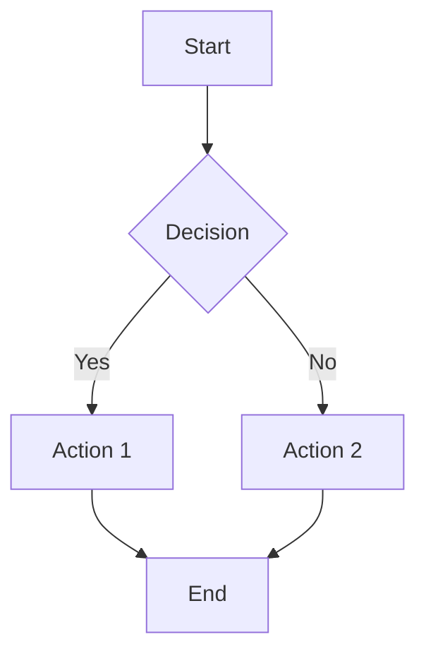
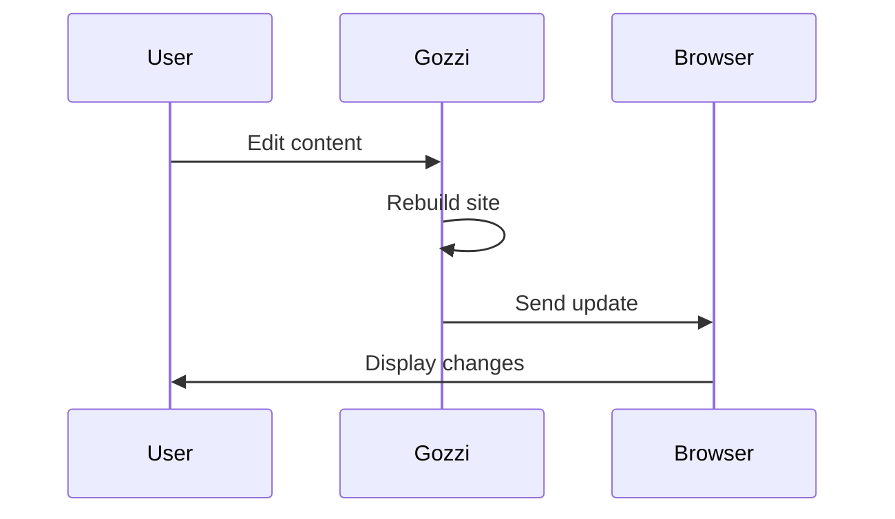

# Other Built-in Features

Gozzi includes a comprehensive set of built-in features that enhance your static site without requiring additional plugins or configuration. These features work automatically with sensible defaults while remaining customizable when needed.

## Table of Contents (TOC)

Gozzi automatically generates a table of contents from your content headings, making long articles more navigable.

### How It Works

The TOC is built from all heading tags (`h1` through `h6`) found in your content. It's accessible in templates via the `{{ .Toc }}` variable.

### Usage in Templates

```html
<!-- Basic TOC display -->
{{ if .Toc }}
<nav class="toc">
  <h3>Table of Contents</h3>
  {{ .Toc }}
</nav>
{{ end }}

<!-- With custom styling -->
<div class="content-navigation">
  {{ .Toc }}
</div>
```

### Customization

The TOC generation respects your content structure and creates nested lists that mirror your heading hierarchy. Style the generated `<ul>` and `<li>` elements with CSS to match your site design.

## Tag Management

Gozzi provides comprehensive tag management, automatically collecting and organizing tags across your content.

### Tag Collection

Tags are extracted from:
- Front matter `tags` field (array or comma-separated string)
- Content analysis for automatic categorization

### Template Variables

```html
<!-- Display tags for current page -->
{{ range .Tags }}
  <span class="tag">{{ . }}</span>
{{ end }}

<!-- Access all site tags -->
{{ range .Site.Tags }}
  <a href="/tags/{{ . | urlize }}">{{ . }}</a>
{{ end }}

<!-- Get tag counts -->
{{ .Site.TagCounts.development }} <!-- Number of posts with "development" tag -->
```

### Tag Pages

Gozzi automatically generates tag listing pages accessible at `/tags/[tag-name]`, showing all content associated with each tag.

## Pagination

Handle large content collections with built-in pagination that works seamlessly with any content type.

### Configuration

```toml
[pagination]
per_page = 10          # Items per page (default: 10)
pagination_path = "page" # URL path for pagination (default: "page")
```

### Template Usage

```html
<!-- Display paginated content -->
{{ range .Paginate.Items }}
  <article>
    <h2><a href="{{ .Permalink }}">{{ .Title }}</a></h2>
    <p>{{ .Summary }}</p>
  </article>
{{ end }}

<!-- Pagination navigation -->
{{ if .Paginate.HasPrev }}
  <a href="{{ .Paginate.PrevURL }}">← Previous</a>
{{ end }}

<span>Page {{ .Paginate.Current }} of {{ .Paginate.Total }}</span>

{{ if .Paginate.HasNext }}
  <a href="{{ .Paginate.NextURL }}">Next →</a>
{{ end }}
```

### Advanced Pagination

```html
<!-- Page number list -->
{{ range .Paginate.Pages }}
  {{ if eq . $.Paginate.Current }}
    <span class="current">{{ . }}</span>
  {{ else }}
    <a href="{{ $.Paginate.PageURL . }}">{{ . }}</a>
  {{ end }}
{{ end }}
```

## RSS/Atom Feeds

Gozzi automatically generates RSS feeds to keep your audience updated with new content.

### Default Feed

- **Location**: `/atom.xml`
- **Format**: Atom 1.0 (widely supported)
- **Content**: Latest posts with full content or summaries

### Configuration

```toml
[feed]
enabled = true
limit = 20                    # Number of recent posts (default: 20)
include_content = true        # Include full content vs summaries
title = "My Blog Feed"
description = "Latest posts from my blog"
```

### Custom Feed Templates

Create `templates/atom.xml` to customize feed format:

```xml
<?xml version="1.0" encoding="UTF-8"?>
<feed xmlns="http://www.w3.org/2005/Atom">
  <title>{{ .Site.Title }}</title>
  <link href="{{ .Site.BaseURL }}/atom.xml" rel="self"/>
  <updated>{{ .Site.LastMod | dateFormat "2006-01-02T15:04:05Z07:00" }}</updated>
  
  {{ range .Site.RecentPosts }}
  <entry>
    <title>{{ .Title }}</title>
    <link href="{{ .Permalink }}"/>
    <updated>{{ .Date | dateFormat "2006-01-02T15:04:05Z07:00" }}</updated>
    <content type="html">{{ .Content | html }}</content>
  </entry>
  {{ end }}
</feed>
```

## SEO Automation

Gozzi automatically generates essential SEO files to improve your site's search engine visibility.

### Sitemap Generation

- **Location**: `/sitemap.xml`
- **Format**: XML sitemap protocol
- **Content**: All pages with last modification dates and priority hints

### Robots.txt

- **Location**: `/robots.txt`
- **Content**: Basic crawling instructions
- **Customizable**: Override with `static/robots.txt`

### Example Generated Sitemap

```xml
<?xml version="1.0" encoding="UTF-8"?>
<urlset xmlns="http://www.sitemaps.org/schemas/sitemap/0.9">
  <url>
    <loc>https://example.com/</loc>
    <lastmod>2024-01-15</lastmod>
    <priority>1.0</priority>
  </url>
  <url>
    <loc>https://example.com/about/</loc>
    <lastmod>2024-01-10</lastmod>
    <priority>0.8</priority>
  </url>
</urlset>
```

## Social Media Integration

Enhance social sharing with automatic image URL generation and meta tag support.

### Image URL Generation

Gozzi automatically generates appropriate image URLs for social media meta tags:

```yaml
# Front matter
featured_image: "cover.jpg"
# or
image: "/images/post-cover.png"
```

### Template Integration

```html
<!-- Open Graph meta tags -->
<meta property="og:image" content="{{ .ImageURL }}" />
<meta property="og:title" content="{{ .Title }}" />
<meta property="og:description" content="{{ .Summary }}" />

<!-- Twitter Card meta tags -->
<meta name="twitter:card" content="summary_large_image" />
<meta name="twitter:image" content="{{ .ImageURL }}" />
<meta name="twitter:title" content="{{ .Title }}" />
```

### Fallback Images

Configure site-wide fallback images in your config:

```toml
[social]
default_image = "/images/site-cover.jpg"
twitter_handle = "@yourusername"
```

## Content Analytics

Gozzi automatically calculates useful content metrics for display and internal use.

### Word Count

Access word counts in templates:

```html
<p>{{ .WordCount }} words</p>

<!-- Conditional display -->
{{ if gt .WordCount 1000 }}
  <span class="long-read">Long read</span>
{{ end }}
```

### Reading Time

Estimated reading time based on average reading speed:

```html
<p>{{ .ReadingTime }} min read</p>

<!-- Detailed breakdown -->
<div class="reading-info">
  {{ .WordCount }} words • {{ .ReadingTime }} min read
</div>
```

### Custom Reading Speed

Configure reading speed in your config:

```toml
[content]
reading_speed = 200  # Words per minute (default: 200)
```

## Mathematical Expressions (KaTeX)

Render beautiful mathematical expressions using KaTeX integration.

### Basic Usage

Include math expressions in your markdown:

```markdown
Inline math: $E = mc^2$

Block math:
$$
\int_{-\infty}^{\infty} e^{-x^2} dx = \sqrt{\pi}
$$
```

### Configuration

```toml
[math]
enabled = true
auto_render = true  # Automatically detect and render math
delimiters = [
  { left = "$$", right = "$$", display = true },
  { left = "$", right = "$", display = false }
]
```

### Template Setup

Include KaTeX in your template head:

```html
<!-- KaTeX CSS -->
<link rel="stylesheet" href="https://cdn.jsdelivr.net/npm/katex@0.16.0/dist/katex.min.css">

<!-- KaTeX JavaScript (in footer) -->
<script src="https://cdn.jsdelivr.net/npm/katex@0.16.0/dist/katex.min.js"></script>
<script src="https://cdn.jsdelivr.net/npm/katex@0.16.0/dist/contrib/auto-render.min.js"></script>

{{ if .HasMath }}
<script>
  document.addEventListener("DOMContentLoaded", function() {
    renderMathInElement(document.body);
  });
</script>
{{ end }}
```

## Mermaid Diagrams

Create beautiful diagrams and flowcharts using Mermaid syntax.

### Usage in Markdown

Use fenced code blocks with `mermaid` language:

````markdown

````

### Supported Diagram Types

- **Flowcharts**: Process flows and decision trees
- **Sequence Diagrams**: System interactions over time
- **Gantt Charts**: Project timelines and schedules
- **Class Diagrams**: Object-oriented relationships
- **State Diagrams**: State machine representations

### Template Integration

```html
<!-- Mermaid JavaScript -->
<script src="https://cdn.jsdelivr.net/npm/mermaid@10.0.0/dist/mermaid.min.js"></script>

{{ if .HasMermaid }}
<script>
  mermaid.initialize({
    startOnLoad: true,
    theme: 'default',
    securityLevel: 'loose'
  });
</script>
{{ end }}
```

### Example Diagrams



## Performance Considerations

All built-in features are designed with performance in mind:

- **Lazy Loading**: Features only activate when content requires them
- **Caching**: Generated content is cached until source changes
- **Minimal Overhead**: Features add minimal build time
- **Selective Inclusion**: Only include external resources (KaTeX, Mermaid) when content uses them

## Feature Integration

These features work seamlessly together:

- Tag pages include pagination automatically
- RSS feeds respect tag filtering
- Social meta tags use calculated reading times
- TOC generation works with math and diagrams
- All features respect configuration inheritance

Combine features to create rich, engaging content experiences without complexity or performance penalties.
