# Architecture

This document provides detailed sequence diagrams and architectural insights into how Gozzi processes content and generates static sites.

## Overview

Gozzi is a fast static site generator built with Go that emphasizes:

- **Concurrent processing**: Leverages goroutines and worker pools for parallel operations
- **Clean separation**: Config, Parser, Builder, Server components with clear responsibilities
- **Hot reloading**: Development server with file watching and live reload via SSE
- **Template flexibility**: Hierarchical template resolution with 40+ built-in functions

## Command Flow

### Build Command Flow

The `gozzi build` command processes your site through four main phases:

1. **Configuration Loading**: Parse TOML configuration files
2. **Content Parsing**: Walk directory tree, parse markdown files, build content tree
3. **Builder Initialization**: Load templates and register template functions
4. **Site Generation**: Render HTML files, generate feeds, copy static assets

### Serve Command Flow

The `gozzi serve` command extends the build process with:

1. **Initial Setup**: Same as build command
2. **Dev Server Initialization**: Create file watcher and HTTP server
3. **File Watching**: Monitor content, templates, static files, and config for changes
4. **Live Reload**: Automatic browser refresh via Server-Sent Events (SSE)

## Detailed Sequence Diagrams

### Build Command - Complete Process

```mermaid
sequenceDiagram
    participant User
    participant Main
    participant Config
    participant Parser
    participant Markdown
    participant Content
    participant Builder
    participant Template
    participant FileSystem

    User->>Main: gozzi build --config config.toml --content content --clean

    Note over Main: Parse CLI flags
    Main->>Main: handleBuildCommand()

    rect rgb(240, 248, 255)
        Note over Main,Config: 1. Configuration Loading Phase
        Main->>Config: LoadSite(configPath)
        Config->>FileSystem: toml.DecodeFile(path)
        FileSystem-->>Config: Raw TOML data
        Config->>Config: Parse Site struct
        Config-->>Main: *Site (base_url, output_dir, etc)
    end

    rect rgb(255, 250, 240)
        Note over Main,Content: 2. Content Parsing Phase
        Main->>Parser: NewParser(site)
        Parser->>Markdown: goldmark.New() with extensions
        Note over Markdown: Extensions: GFM, Footnote,<br/>Highlighting, Math, TOC
        Markdown-->>Parser: Configured goldmark instance
        Parser-->>Main: *ContentParser

        Main->>Parser: Parse(contentDir)
        Parser->>Parser: Reset ContentMap
        Parser->>FileSystem: filepath.WalkDir(rootDir)

        loop For each file in content directory
            FileSystem-->>Parser: File path + DirEntry

            alt File is _index.md (Section)
                Parser->>Parser: parseSection(path, dir)
                Parser->>FileSystem: os.ReadFile(path)
                FileSystem-->>Parser: Raw markdown content
                Parser->>Config: LoadFrontMatter(mdContent)
                Config->>Config: Split by +++ delimiter
                Config->>Config: toml.Unmarshal(frontMatter)
                Config-->>Parser: *FrontMatter, body content

                alt frontMatter.Draft == true
                    Parser->>Parser: Skip draft section
                else Process section
                    Parser->>Markdown: Parse(contentPart)
                    Markdown->>Markdown: AST generation
                    Markdown->>Markdown: Extract TOC
                    Markdown-->>Parser: Document AST + TOC
                    Parser->>Markdown: Render(AST)
                    Markdown-->>Parser: HTML string

                    Parser->>Config: MergeConfigs(site, section, nil)
                    Config-->>Parser: Merged configuration

                    Parser->>Content: GenerateSlug(path, parent)
                    Content->>Content: Extract basename
                    Content->>Content: Remove date prefix (YYYY-MM-DD-)
                    Content->>Content: Normalize to lowercase
                    Content->>Content: Replace _ with -
                    Content-->>Parser: URL slug

                    Parser->>Parser: Calculate word count & read time
                    Parser->>Content: NewContentNode()
                    Content-->>Parser: *Node (NodeTypeSection)
                    Parser->>Parser: ContentMap[dir] = node
                    Parser->>Parser: Link to parent's children
                end

            else File is *.md (Page)
                Parser->>Parser: parsePage(path, dir)
                Parser->>FileSystem: os.ReadFile(path)
                FileSystem-->>Parser: Raw markdown content
                Parser->>Config: LoadFrontMatter(mdContent)
                Config-->>Parser: *FrontMatter, body content

                alt frontMatter.Draft == true
                    Parser->>Parser: Skip draft page
                else Process page
                    Parser->>Markdown: Parse(contentPart)
                    Markdown-->>Parser: Document AST + TOC
                    Parser->>Markdown: Render(AST)
                    Markdown-->>Parser: HTML string

                    Parser->>Parser: GetOrCreateSection(dir)
                    Note over Parser: Ensures parent section exists

                    Parser->>Config: MergeConfigs(site, section, page)
                    Config-->>Parser: Merged configuration

                    Parser->>Content: GenerateSlug(pagePath, parent)
                    Content-->>Parser: URL slug

                    Parser->>Parser: Calculate word count & read time
                    Parser->>Content: NewContentNode()
                    Content-->>Parser: *Node (NodeTypePage)

                    alt Page has tags
                        Parser->>Parser: parseTags(pageConfig, pageNode)
                        Parser->>Parser: Update Tags map
                    end

                    Parser->>Parser: Add to parent.Children
                end
            end
        end

        Parser->>Parser: paginator.BuildLinks()
        Note over Parser: Links Higher/Lower pages
        Parser-->>Main: ContentMap populated
    end

    rect rgb(240, 255, 240)
        Note over Main,Template: 3. Builder Initialization Phase
        Main->>Builder: NewBuilder(site, parser)
        Builder->>Template: NewEngine(config)
        Template->>Template: CreateDefaultRegistry()
        Note over Template: Register 40+ template functions:<br/>add, sub, eq, first, last, date,<br/>markdown, asset, get_section, etc
        Template-->>Builder: *Engine

        Builder->>Builder: loadTemplates()
        Builder->>Template: CreateFuncMap()
        Template-->>Builder: template.FuncMap
        Builder->>Builder: template.New("").Funcs(funcMap)

        Builder->>FileSystem: filepath.WalkDir("templates")
        loop For each template file
            FileSystem-->>Builder: Template file path
            Builder->>FileSystem: os.ReadFile(path)
            FileSystem-->>Builder: Template content
            Builder->>Builder: tmpl.New(name).Parse(content)
        end

        Builder->>Builder: Add pagination macro
        Builder-->>Main: *Builder with loaded templates
    end

    opt --clean flag provided
        Main->>FileSystem: os.RemoveAll(outputDir)
        FileSystem-->>Main: Output directory cleaned
    end

    rect rgb(255, 240, 245)
        Note over Main,FileSystem: 4. Site Generation Phase
        Main->>Builder: Generate(contentMap["."])
        Builder->>FileSystem: os.MkdirAll(outputDir, 0755)

        Note over Builder: Create goroutine pool (NumCPU*2)
        Builder->>Builder: walkNodes(contentRoot)

        par Concurrent Node Processing
            loop For each node in content tree
                Builder->>Builder: processNode(node) [goroutine]

                alt node.Type == NodeTypeSection
                    Builder->>Builder: generateSection(node)
                    Builder->>Builder: Prepare template data
                    Note over Builder: Data: Site, Config, Page, Section
                    Builder->>Builder: renderTemplate(node, outputPath, data)
                    Builder->>Builder: Find template from chain
                    Note over Builder: Template chain:<br/>1. Custom template (if specified)<br/>2. Parent templates<br/>3. default.html
                    Builder->>Builder: tmpl.Execute(data)
                    Builder->>FileSystem: os.WriteFile(outputPath, html)

                else node.Type == NodeTypePage
                    Builder->>Builder: generatePage(node)
                    Builder->>Builder: copyPageAssets(node)
                    opt Page has assets
                        Builder->>FileSystem: copyDir(assets, dest)
                    end
                    Builder->>Builder: renderTemplate(node, outputPath, data)
                    Builder->>FileSystem: os.WriteFile(outputPath, html)
                end
            end
        end

        Builder->>Builder: Wait for all goroutines

        Builder->>Builder: generate404Page()
        opt 404.html template exists
            Builder->>Builder: renderTemplate(nil, "404.html", data)
            Builder->>FileSystem: Write 404.html
        end

        Builder->>Builder: generateTagPages()
        loop For each tag in Tags map
            Builder->>Builder: renderTemplate(tag, outputPath, data)
            Builder->>FileSystem: Write tag page
            Builder->>Builder: renderTemplate(tag list, outputPath, data)
            Builder->>FileSystem: Write tags index
        end

        Builder->>Builder: generateRobotsTxt()
        Builder->>FileSystem: Write robots.txt

        Builder->>Builder: generateAtomFeed()
        opt generate_feed enabled
            Builder->>Builder: Create XML feed from pages
            Builder->>FileSystem: Write atom.xml
        end

        Builder->>Builder: generateSitemap()
        Builder->>Builder: Collect all URLs
        Builder->>FileSystem: Write sitemap.xml

        Builder->>Builder: copyStaticAssets()
        Builder->>FileSystem: filepath.WalkDir("static")
        loop For each static file
            Builder->>FileSystem: copyFile(src, dst)
        end

        Builder-->>Main: Generation complete
    end

    Main->>Main: Calculate build time
    Main->>User: Build done in Xms
```



### Serve Command - Development Server

```mermaid
sequenceDiagram
    participant User
    participant Main
    participant Config
    participant Parser
    participant Builder
    participant Server
    participant Watcher
    participant HTTP
    participant Browser

    User->>Main: gozzi serve --config config.toml --port 1313

    Note over Main: Parse CLI flags
    Main->>Main: handleServeCommand()

    rect rgb(240, 248, 255)
        Note over Main,Builder: 1. Initial Setup (Same as Build)
        Main->>Main: initApp(configPath, contentDir)
        Main->>Config: LoadSite(configPath)
        Config-->>Main: *Site
        Main->>Parser: NewParser(site)
        Parser-->>Main: *ContentParser
        Main->>Parser: Parse(contentDir)
        Parser-->>Main: ContentMap populated
        Main->>Builder: NewBuilder(site, parser)
        Builder-->>Main: *Builder
    end

    rect rgb(255, 250, 240)
        Note over Main,Watcher: 2. Dev Server Initialization
        Main->>Server: NewDevServer(configPath, contentDir, site, gen, parser)
        Server->>Watcher: fsnotify.NewWatcher()
        Watcher-->>Server: *Watcher instance
        Server->>Server: Initialize client channels map
        Server-->>Main: *DevServer
    end

    rect rgb(240, 255, 240)
        Note over Server,HTTP: 3. Initial Build & Server Start
        Main->>Server: Start(port)
        Server->>Server: initialize()
        Server->>Parser: Parse(contentDir)
        Parser-->>Server: ContentMap populated
        Server->>Builder: Generate(contentMap["."])
        Builder-->>Server: Initial site built

        Note over Server: Setup file watching in goroutine
        Server->>Watcher: Start watchChanges() [goroutine]

        loop Setup watchers for directories
            Watcher->>Watcher: WalkDir each path
            Note over Watcher: Paths: config dir,<br/>content, templates, static
            Watcher->>Watcher: watcher.Add(directory)
        end

        Server->>HTTP: Setup HTTP handlers
        Server->>HTTP: mux.Handle("/", fileHandler)
        Note over HTTP: fileHandler serves from outputDir<br/>with 404.html fallback
        Server->>HTTP: mux.HandleFunc("/livereload", handleLiveReload)

        Server->>HTTP: http.ListenAndServe(":port", mux)
        Server->>User: Server listening on http://localhost:1313
    end

    rect rgb(255, 240, 245)
        Note over Browser,HTTP: 4. Browser Connection
        Browser->>HTTP: GET / (initial page load)
        HTTP->>HTTP: fileHandler.ServeHTTP()
        HTTP->>HTTP: Inject livereload script
        Note over HTTP: Inserts <script> for /livereload<br/>before </body> tag
        HTTP-->>Browser: HTML + livereload script

        Browser->>HTTP: GET /livereload (SSE connection)
        HTTP->>Server: handleLiveReload()
        Server->>Server: Create client channel
        Server->>Server: clients[clientChan] = struct{}{}
        Note over Server,Browser: SSE connection kept alive
    end

    rect rgb(250, 240, 255)
        Note over User,Watcher: 5. File Change Detection & Rebuild
        User->>User: Edit content/blog/post.md

        Watcher->>Watcher: Detect fsnotify.Event
        Watcher->>Watcher: isRelevantChange(event)?
        Note over Watcher: Check extensions:<br/>.md, .html, .css, .js, config.toml

        alt Relevant change detected
            Watcher->>Watcher: Start debounce timer (500ms)
            Note over Watcher: Multiple rapid changes<br/>trigger single rebuild

            Watcher->>Watcher: Timer expires
            Watcher->>Server: triggerRebuild()

            Server->>Server: reloadConfig()
            Server->>Config: os.ReadFile(configPath)
            Config-->>Server: File content
            Server->>Server: Calculate MD5 hash

            alt Config hash changed
                Server->>Config: LoadSite(configPath)
                Config-->>Server: New *Site
                Server->>Parser: NewParser(newSite)
                Server->>Parser: Parse(contentDir)
                Server->>Builder: NewBuilder(newSite, parser)
                Server->>Server: Update site, parser, gen
            else Config unchanged
                Server->>Server: Skip config reload
            end

            Server->>Builder: ReloadTemplates()
            Builder->>Builder: loadTemplates()
            Note over Builder: Re-parse all template files
            Builder-->>Server: Templates reloaded

            Server->>Parser: Parse(contentDir)
            Note over Parser: Re-parse all content files
            Parser-->>Server: ContentMap updated

            Server->>Builder: Generate(contentMap["."])
            Note over Builder: Rebuild entire site
            Builder-->>Server: Site regenerated

            Server->>Server: notifyClients()

            loop For each connected client
                Server->>HTTP: Send "reload" message
                HTTP->>Browser: SSE event: "reload"
                Browser->>Browser: window.location.reload()
                Browser->>HTTP: GET / (reload page)
                HTTP-->>Browser: Updated HTML
            end

            Server->>User: Change detected, build done in Xms
        else Not relevant change
            Watcher->>Watcher: Ignore event
        end
    end

    rect rgb(240, 245, 255)
        Note over Server,Browser: 6. Concurrent Operations

        par Continuous Operations
            loop File watching
                Watcher->>Watcher: Monitor for changes
            end
        and
            loop HTTP serving
                Browser->>HTTP: Request resources
                HTTP-->>Browser: Serve files
            end
        and
            loop SSE connection
                Server->>Browser: Keep-alive heartbeat
            end
        end
    end

    User->>Main: Ctrl+C (SIGINT)
    Main->>Watcher: Close watcher
    Main->>Server: Shutdown server
    Server->>HTTP: Close connections
    Main->>User: Server stopped
```



## Content Structure & Processing

### Directory Structure to Node Tree

Gozzi transforms your content directory into a hierarchical tree of nodes:

```
content/
├── _index.md          → Section (NodeTypeSection)
├── blog/
│   ├── _index.md      → Section
│   ├── post.md        → Page (NodeTypePage)
│   └── post-2/
│       └── index.md   → Page (bundle format)
└── about/
    └── _index.md      → Section
```

### Node Types

**Section (NodeTypeSection)**

- Represents a directory with an `_index.md` file
- Can have child sections and pages
- Renders to `section-slug/index.html`

**Page (NodeTypePage)**

- Represents a markdown file (`.md`)
- Always belongs to a parent section
- Renders to `page-slug/index.html`

### Slug Generation

The slug generation process:

1. Extract basename from file path
2. Remove date prefix pattern: `YYYY-MM-DD-` or `YYYY_MM_DD_`
3. Convert to lowercase
4. Replace underscores with hyphens
5. Remove non-alphanumeric characters (except hyphens)
6. Collapse multiple consecutive hyphens
7. Trim leading/trailing hyphens
8. Combine with parent slug if exists

Example:

```
content/blog/2024-01-15-my-first-post.md
  → basename: 2024-01-15-my-first-post
  → remove date: my-first-post
  → parent slug: blog
  → final slug: blog/my-first-post
  → URL: /blog/my-first-post/
```

### Front Matter Parsing

Gozzi uses TOML front matter delimited by `+++`:

```toml
+++
title = "My Post"
date = 2024-01-15
tags = ["go", "web"]
draft = false
template = "post.html"
+++

# Post content here
```

The parser:

1. Splits content by `+++` delimiter
2. Unmarshals TOML into `FrontMatter` struct
3. Merges with parent section and site configs
4. Lower level configs override higher levels

### Configuration Merging

Configuration priority (highest to lowest):

1. **Page config** (from page front matter)
2. **Section config** (from section `_index.md` front matter)
3. **Site config** (from `config.toml`)

Example merge:

```toml
# config.toml
title = "My Site"
language = "en"

# blog/_index.md
+++
title = "Blog Section"
+++

# blog/post.md
+++
title = "Specific Post"
+++

# Result for post:
# title = "Specific Post"  (from page)
# language = "en"           (from site)
```

## Template System

### Template Resolution Chain

When rendering a node, Gozzi looks for templates in this order:

1. **Custom template** specified in `template` field
2. **Parent templates** (inherited from parent sections)
3. **default.html** (fallback)

Example:

```
Node: blog/post
  → template: "post.html" (if specified)
  → parent template: "blog.html" (if blog section has one)
  → default: "default.html"
```

### Template Data Structure

Every template receives this data structure:

```go
{
  "Site": {
    "Config": {
      "base_url": "https://example.com",
      "title": "Site Title",
      "output_dir": "public",
      "lang": "en",
      // ... other site config
    }
  },
  "Config": {
    // Merged page/section/site config
  },
  "Page": {
    "Type": NodeTypePage,
    "Slug": "blog/my-post",
    "Permalink": "/blog/my-post/",
    "URL": "https://example.com/blog/my-post",
    "Content": "<p>HTML content</p>",
    "WordCount": 450,
    "ReadTime": 3,
    "Toc": [...],
    "Children": [...],
    "Parent": {...},
    "Higher": {...},  // Previous page
    "Lower": {...}     // Next page
  },
  "Section": {
    // Same structure as Page
  }
}
```

### Built-in Template Functions

Gozzi provides 40+ template functions organized into categories:

**Core Functions**

- `add`, `sub` - Arithmetic operations
- `eq`, `ne` - Equality testing
- `and`, `or` - Logical operations

**Collection Functions**

- `first`, `last` - Get first/last element
- `contains` - Check if collection contains value
- `reverse` - Reverse a slice
- `concat` - Merge multiple slices
- `sort_by` - Sort nodes by field
- `limit` - Limit number of items
- `where` - Filter items by field value
- `group_by` - Group nodes by date field

**String Functions**

- `lower`, `upper` - Case conversion
- `trim` - Trim whitespace
- `replace` - Replace substring
- `split`, `join` - String splitting/joining
- `has_prefix`, `has_suffix` - Prefix/suffix checking
- `urlize` - Convert to URL slug
- `default` - Default value if empty
- `pluralize` - Pluralize word based on count

**Date Functions**

- `date` - Format date
- `to_date` - Parse date string
- `now` - Current time

**Content Functions**

- `asset` - Generate asset URL
- `get_section` - Get section by path
- `markdown` - Render markdown to HTML
- `safe` - Mark HTML as safe
- `load` - Load file as HTML
- `pagination` - Render pagination macro

## Concurrency & Performance

### Parallel Content Processing

The parser uses a worker pool pattern:

```go
// Default: runtime.NumCPU() workers
pool := utils.NewWorkerPool(ctx)
pool.ProcessFiles(files, func(ctx context.Context, filePath string) error {
    // Process each file concurrently
})
```

### Parallel Site Generation

The builder uses a goroutine pool for parallel rendering:

```go
// Pool size: NumCPU * 2
sem := make(chan struct{}, runtime.NumCPU()*2)
var wg sync.WaitGroup

for each node {
    wg.Add(1)
    sem <- struct{}{}
    go func(node *content.Node) {
        defer func() { <-sem; wg.Done() }()
        processNode(node)
    }(node)
}
wg.Wait()
```

### File Watching Debouncing

The dev server debounces file changes to prevent rebuild storms:

- **Debounce duration**: 500ms
- **Mechanism**: Timer resets on each file change event
- **Rebuild trigger**: Only after timer expires without new changes
- **Minimum rebuild interval**: 500ms between rebuilds

This ensures multiple rapid file saves trigger only one rebuild.

## Development Server Details

### Live Reload Implementation

Gozzi implements live reload using Server-Sent Events (SSE):

1. **JavaScript injection**: The file handler injects JavaScript into every HTML response
2. **SSE connection**: Browser opens EventSource connection to `/livereload`
3. **Client registry**: Server maintains map of connected clients
4. **Change notification**: On file change, server sends "reload" message to all clients
5. **Browser reload**: JavaScript receives message and calls `window.location.reload()`

### File Watching Strategy

The watcher monitors these directories:

- **Config directory** (where `config.toml` is located)
- **Content directory** (`content/` by default)
- **Templates directory** (`templates/`)
- **Static directory** (`static/`)

Watched file extensions:

- `.md` - Markdown content
- `.html` - HTML templates
- `.css` - Stylesheets
- `.js` - JavaScript files
- `config.toml` - Configuration file

Ignored paths:

- Output directory (prevents infinite loops)
- Hidden directories (starting with `.`)
- Non-relevant file types

### Rebuild Strategy

On file change, the server:

1. **Config reload** (if config changed)
    - Load new config
    - Create new parser and builder with updated config
    - Replace old instances

2. **Template reload**
    - Re-parse all template files
    - Rebuild function map
    - Update template cache

3. **Content reparse**
    - Re-walk content directory
    - Parse all markdown files
    - Rebuild content tree

4. **Full regeneration**
    - Render all pages
    - Generate feeds and sitemaps
    - Copy static assets

5. **Client notification**
    - Broadcast "reload" to all connected browsers

## Performance Characteristics

### Build Performance

Typical build times:

- **Small site** (10-50 pages): 50-200ms
- **Medium site** (100-500 pages): 200ms-1s
- **Large site** (1000+ pages): 1-5s

Performance factors:

- Concurrent processing scales with CPU cores
- Markdown parsing is CPU-bound
- Template rendering is memory-bound
- File I/O is typically not the bottleneck

### Memory Usage

Memory consumption scales with:

- Number of pages (content tree in memory)
- Template complexity (parsed template cache)
- Markdown parsing (temporary AST structures)

Typical memory usage:

- **Small site**: 20-50 MB
- **Medium site**: 50-150 MB
- **Large site**: 150-500 MB

### Development Server Performance

- **Hot reload latency**: 100-500ms (depends on site size)
- **SSE overhead**: Minimal (one goroutine per connected client)
- **File watching overhead**: Negligible (efficient event-based monitoring)

## Error Handling

Gozzi uses a structured error handling approach:

### Error Wrapping

All errors are wrapped with context:

```go
utils.WrapWithContext(err, utils.ErrTemplate, utils.ErrorContext{
    Operation: "parse_template",
    Component: "builder",
    Path:      templateName,
})
```

### Error Types

- `ErrConfig` - Configuration errors
- `ErrContent` - Content parsing errors
- `ErrTemplate` - Template processing errors
- `ErrFileSystem` - File I/O errors
- `ErrServer` - Server runtime errors

### Draft Content

Draft content is silently skipped during parsing:

```go
if frontMatter.Draft {
    return nil // Skip without error
}
```

### Missing Templates

If no template is found in the resolution chain, an error is returned:

```go
if tpl == nil {
    return fmt.Errorf("no template found")
}
```

## Best Practices

### Content Organization

✅ **Do**

- Use `_index.md` for section pages
- Organize content in logical directories
- Use date prefixes for chronological content
- Keep related assets in page bundles

❌ **Don't**

- Mix section and page files in same directory
- Use spaces in filenames (use hyphens)
- Nest sections too deeply (keep it flat)

### Template Design

✅ **Do**

- Use template inheritance for consistency
- Define default template for all pages
- Use partial templates for reusable components
- Leverage built-in template functions

❌ **Don't**

- Duplicate template logic across files
- Hard-code URLs (use `asset` and `get_section` functions)
- Ignore the template resolution chain

### Performance Optimization

✅ **Do**

- Use `limit` function to control large lists
- Paginate long content lists
- Optimize images before adding to static directory
- Use `--clean` flag sparingly (only when needed)

❌ **Don't**

- Load entire site in every template
- Process large collections on every page
- Include unoptimized media files

### Development Workflow

✅ **Do**

- Use `serve` command during development
- Watch the build logs for errors
- Test with `--clean` before production build
- Validate generated HTML output

❌ **Don't**

- Edit files in output directory
- Ignore build warnings
- Assume dev server output matches build output

## Troubleshooting

### Common Issues

**Build fails with "no template found"**

- Ensure `default.html` exists in `templates/`
- Check template name spelling in front matter
- Verify template files have `.html` extension

**Page not showing up**

- Check if page is marked as `draft = true`
- Verify file has `.md` extension
- Ensure content directory is specified correctly

**Live reload not working**

- Check browser console for JavaScript errors
- Verify `/livereload` endpoint is accessible
- Clear browser cache and reload

**Slow build times**

- Profile with Go profiler to identify bottlenecks
- Check for excessive template complexity
- Verify file system is not slow (network drives)

**Memory issues**

- Reduce concurrent worker count
- Optimize large template files
- Check for memory leaks in custom functions

## Further Reading

- [Configuration Guide](../guide/configuration.md)
- [Template Functions Reference](./template-functions.md)
- [CLI Reference](./cli.md)
- [Content Structure Guide](../guide/content-structure.md)
