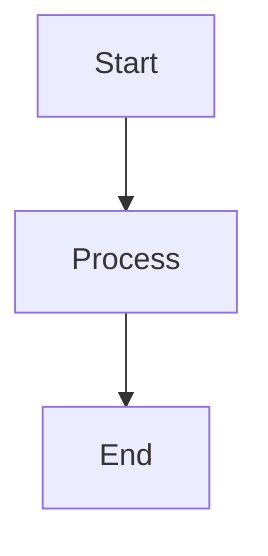

# ABOUTME: Sample markdown file with front matter for testing content parsing
# ABOUTME: Includes all possible front matter fields and markdown content

+++
title = "Test Post"
description = "A test post for unit testing"
date = 2024-01-15T10:30:00Z
updated = 2024-01-16T12:00:00Z
tags = ["test", "golang", "markdown"]
template = "post.html"
draft = false
featured = true
generate_feed = true
language = "en"
img = "/images/test-post.jpg"

[extra]
author = "Test Author"
custom = "value"
+++

# Test Post Title

This is a **test post** with _various_ markdown elements.

## Code Block

```go
func main() {
    fmt.Println("Hello, World!")
}
```

## List

- Item 1
- Item 2
- Item 3

## Table

| Column 1 | Column 2 |
|----------|----------|
| Value 1  | Value 2  |

## Math

$$E = mc^2$$

## Mermaid Diagram



This post has `220` words to test read time calculation.